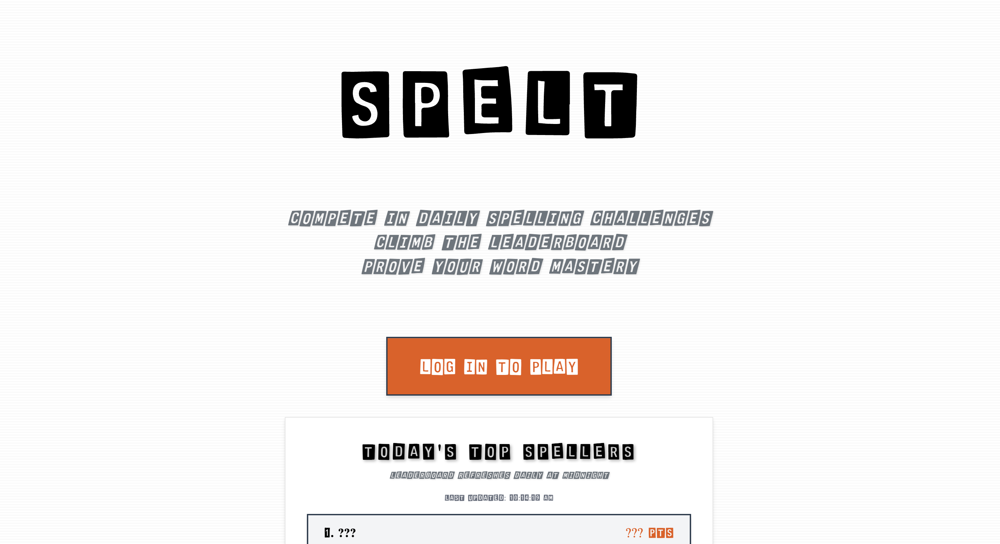

# [Spelt](https://amenlemiesa.github.io/Spelt/)

## Project Summary

**Spelt** is a modern, competitive web app where users test their spelling skills in an animated, audio-driven game, climbing a real-time, timezone-accurate leaderboard that resets daily at midnight Eastern Time.

---

## Features
- Audio-based spelling challenges
- Animated custom input and UI
- Real-time leaderboard (resets daily at ET)
- Google sign-in for secure play
- Responsive, newspaper-inspired design

---

## Tech Stack
- **React 19**
- **Vite**
- **Tailwind CSS**
- **Firebase (Firestore & Auth)**
- **date-fns-tz** (timezone handling)
- **GitHub Pages** (CI/CD deployment)

## © 2025 Spelt. All rights reserved.
